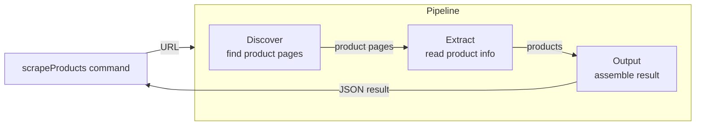

# Natter

Command-line tool for scraping websites, built with Node.js, TypeScript, Playwright and Commander for natter take-home technical test

For details concerning the test itself see the "Technical Test" section further down

## Requirements

- Node.js 24+
- pnpm 9+

## Setup

```sh
nvm install # or install nvm from here first https://github.com/nvm-sh/nvm#installing-and-updating
pnpm install
pnpm exec playwright install chromium
```

## Usage

```sh
pnpm dev --help
pnpm dev scrapeProducts --url https://webscraper.io/test-sites/e-commerce/static
pnpm dev scrapeProducts --url https://webscraper.io/test-sites/e-commerce/static --headed
pnpm dev scrapeProducts --url https://webscraper.io/test-sites/e-commerce/static --headed >> ./output.txt # write to file full output
```

## Scripts

| Script            | Description                          |
| ----------------- | ------------------------------------ |
| `pnpm dev`        | Run the CLI from source with tsx     |
| `pnpm build`      | Compile TypeScript to `dist/`        |
| `pnpm start`      | Run the compiled CLI                 |
| `pnpm typecheck`  | Type-check without emitting          |
| `pnpm test`       | Run unit tests once with Vitest      |
| `pnpm test:watch` | Run unit tests in watch mode         |
| `pnpm lint`       | Lint with ESLint                     |
| `pnpm lint:fix`   | Lint and auto-fix                    |

## Project structure

```
src/
  index.ts                  CLI entry point
  cli.ts                    Commander program setup
  commands/                 One file per CLI command
  browser/                  Playwright helpers
  pipeline/                 Scraping pipeline
    pipeline.ts             Runs the stages in order
    discovery.ts            Discovers and assembles product pages
    extraction.ts           Extracts product info from product pages
    output.ts               Assembles and returns the collected products
    types.ts                Data passed between stages
tests/                      Vitest unit tests
```

# Technical test

## Duration

Building the application to it's current state took around 2 hours while working with Claude.

I started the timer the moment I started looking into the problem received by mail and stopped it around the time of the second last commit.

## High level approach



The application exposes a scrapeProducts command that takes an url and feeds that to the pipeline which is split in 3 stages: discovery, extraction and output where each stage has it's own dedicated role.

1. Discovery: builds up the list of product page url to extract information from
    - During this stage the application will first discover and visit each url that leads to a list of products.
    - Afterwards, for each page that has a paginator it will will build up the list of pages to visit. if there is no paginator it will keep current page
    - Finally once it has all the pages that list products, it will extract all the product page urls and call the extraction stage with the list of product pages
2. Extract: receives the list of product page url and extracts the actual information from the page
    - this stage will extract the name, description, price and colors if available and it will produce a product for each product variant available based on the HDD options
3. Output: prepares the extracted product information to the final output.
    - this stage receives the list of extracted product information, computes the total and hands back the pipeline result to be reported

## Known limitations 

For the purposes of the test, the application has been built to scrape the website mentioned in the test description only (https://webscraper.io/test-sites/e-commerce/static).

## Improvements I would have made given more time

### Error handling

As of now there is very little error handling in the application. 

For the purposes of this test I focused on having the application functional within the available time but in real scenarios good error handling might be a hard requirement.
If this application were to be deployed in a real production environment and other system components would need the data it produces i would have invested time in handling errors better which in turn would help with: 
- preventing the application from crashing and not being able to scrape again until it is up again
- helping the application continue to scrape even though it might have encountered an error on a product
- debugging in general

### Deployment

This is dependent on the environment in which the application would need to run but assuming the default i would have invested some time to containerise this application and I would have set up pre-commit hook and a CI/CD pipeline to run all my sanity checks (type-checking, linting, build, run tests, automated code-review, etc...) on the application and build the docker image to be pushed to an image registry from where it could be pulled and run where needed.

### Testing

Given more time I would have setup a fake website and use it to run e2e tests against it. The advantage of using a fake website is that it would allow me to check the output of my application against an expected output everytime i change something and potentially update the fake website as I see fit to allow me to cover more testing scenarios.

### Project structure

For the purpose of this test I've kept the project structure very simple although i recognise the fact that if this application grows keeping the same structure would not work out very well. There could be new commands added, other types of data to be scraped, new pipelines created, etc...

To handle this I would keep an application entry point where i initialise and register my application commands and start build verticals in my application in order to separate the different domain of my application and build a folder structure that is informative to the new joiners on the project.

Example:
```
src/
  main.ts                          Entry point: builds the CLI and parses argv
  app/
    cli.ts                         Creates the Commander program and registers commands
    modules.ts                     List of enabled modules ([productsModule, reviewsModule, ...])
    commands/                      Commands with no vertical (e.g. `doctor`, `listSites`)

  shared/                          Shared functionality
    domain/
      url.ts                       Url value object (normalizeUrl, sameOrigin)
      money.ts                     Money value object (parse "$416.99", sum, round to cents)
    infrastructure/
      browser/
        browser.ts                 withPage, launch options (current src/browser)
        dom.ts                     readText / readAttribute helpers used by every adapter
    cli/
      spinner.ts                   (current src/ui/spinner.ts)
      progressReporter.ts          showProgress(spinner, labels), generic over stage names

  modules/
    products/                      Bounded context: products scraping
      domain/
        product.ts                 Product entity (name, description, price: Money, colors)
        productPage.ts             ProductPage value object
        productsPipelineResult.ts  Aggregate: products + total
      application/
        scrapeProducts.ts          Use case: discovery → extraction → catalog
      infrastructure/
        sites/
          webscraperStatic/        Adapter for the test site
            discoverer.ts          implements page discovery
            extractor.ts           implements product data extraction
            output.ts              implements extracted data assembly
      interface/
        scrapeProducts.command.ts
      index.ts                     Module's public API: productsModule

    reviews/                       Example new vertical, same shape
      domain/  
      application/  
      infrastructure/  
      interface/
        cli/  
      index.ts
    articles/
      ...
```

### Performance

The current implementation works sequentially but paralelysing product page processing could provide massive performance improvements by extracting product information from multiple products at once and starting to process products as soon as one is identified instead of waiting for the full list of products to be built.

